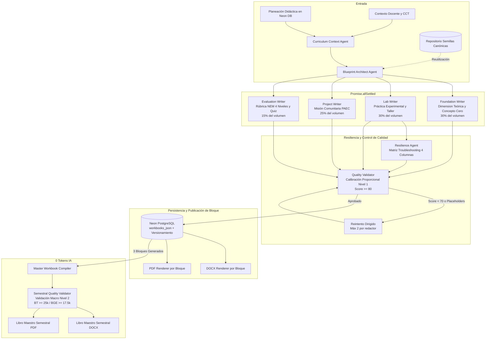

# ARQUITECTURA TÉCNICA Y PEDAGÓGICA: MOTOR EDITORIAL DE LIBROS DE TRABAJO
## SIGPDA-EMS · DBEPA Puebla · Ciclo Escolar 2026-2027

> **Estado:** Documentación Oficial del Sistema y Especificación de Arquitectura  
> **Modelo Pedagógico:** Enfoque Finlandia-Puebla (Aprendizaje Activo, Resolución de Problemas y NEM)  
> **Unidad de Entrega:** Cuadernos de Trabajo por Bloque (~50 págs) y Libro de Texto Semestral Consolidado (~150-200 págs)

---

## 1. Visión General y Propósito del Sistema

El **Motor Editorial de Libros de Trabajo Activo de SIGPDA-EMS** es un subsistema inteligente de generación curricular que transforma las planeaciones didácticas de los docentes en libros de texto completos, estructurados y listos para el aula.

A diferencia de los resúmenes genéricos de IA, este motor produce instrumentos de aprendizaje activos diseñados para que los alumnos de Educación Media Superior (Bachillerato General Estatal - BGE y Bachillerato Tecnológico - BT):
1. Comprendan conceptos abstractos mediante **analogías físicas intuitivas sin tecnicismos innecesarios (Concepto Cero)**.
2. Desarrollen competencias a través del andamiaje pedagógico **"Yo Hago" (demostración resuelta) → "Hacemos" (práctica guiada) → "Tú Haces" (desafío autónomo)**.
3. Resuelvan incidentes técnicos con una **matriz formativa de troubleshooting ("¿Qué hacer si falla?")**.
4. Articulen sus aprendizajes con la comunidad mediante un **proyecto integrador vinculado al PAEC escolar**.
5. Se autoevalúen con **rúbricas analíticas oficiales de 4 niveles de la DBEPA/SEMS**.

---

## 2. Diagrama de Arquitectura del Pipeline Editorial



---

## 3. Las 4 Dimensiones Pedagógicas (Redactores Especializados)

El contenido de cada bloque se genera a través de 4 redactores concurrentes ejecutados en paralelo con `Promise.allSettled()`, garantizando aislamiento de fallos:

| Redactor | Dimensión Pedagógica | Cuota de Palabras | Contenido Clave |
| :--- | :--- | :--- | :--- |
| **Foundation Writer** (`foundation-writer.ts`) | **Fundamentación Teórica y Conceptual** | **30%** (~3,400 palabras) | **Concepto Cero**: Analogía física intuitiva sin tecnicismos; explicación nuclear; demostración modelada paso a paso ("Yo Hago"); práctica colaborativa ("Hacemos"); reto autónomo ("Tú Haces"). |
| **Lab Writer** (`lab-writer.ts`) | **Práctica Experimental y Taller** | **30%** (~3,400 palabras) | Procedimiento de laboratorio/taller paso a paso; esquema de tabla para registro empírico de mediciones; **Matriz de Troubleshooting ("¿Qué hacer si falla?")** con Síntoma, Causa Raíz, Solución Metódica y Prevención. |
| **Project Writer** (`project-writer.ts`) | **Aplicación Comunitaria (PAEC)** | **25%** (~2,800 palabras) | Misión orientada a mitigar la problemática escolar del PAEC; desglose en 3 fases de ingeniería/desarrollo (Diagnóstico, Construcción, Validación en campo); especificaciones técnicas NOM/ISO y criterios de aceptación objetivos. |
| **Evaluation Writer** (`evaluation-writer.ts`) | **Evaluación Formativa Integral** | **15%** (~1,700 palabras) | **Rúbrica analítica NEM de 4 niveles** (Excelente, Bueno, Suficiente, Requiere Apoyo); lista de cotejo objetiva; quiz de pensamiento crítico contextualizado; preguntas de reflexión metacognitiva. |

---

## 4. Sistema de Calidad Calibrado en Dos Niveles (Opción 3 Proporcional)

Para resolver el desfase entre las cuotas semestrales de texto y el límite físico de salida de los LLMs (`maxOutputTokens: 8192` por llamada), el sistema implementa una **calibración proporcional jerárquica**:

```
┌────────────────────────────────────────────────────────────────────────┐
│                        ARQUITECTURA DE CALIDAD                         │
├──────────────────────────────────────┬─────────────────────────────────┤
│    NIVEL 1: POR BLOQUE (Tercio)      │   NIVEL 2: SEMESTRAL (Macro)    │
│    (block-guide-orchestrator.ts)     │   (master-workbook-compiler.ts) │
├──────────────────────────────────────┼─────────────────────────────────┤
│ BT:  Min 8,333 / Ideal 13,333 palabras│ BT:  >= 25,000 palabras oficiales│
│ BGE: Min 5,833 / Ideal  9,333 palabras│ BGE: >= 17,500 palabras oficiales│
│                                      │                                 │
│ • Valida cada redactor individual    │ • Valida la suma de 3 bloques   │
│ • Reintenta redactores específicos   │ • Penaliza -10 pts por warnings │
│ • Pilotos BT (11.2k) y BGE (9.7k)    │ • Gating de descarga de libro   │
│   obtienen Score 95/100 sin warning  │   completo si volumen < macro   │
└──────────────────────────────────────┴─────────────────────────────────┘
```

### Reglas de Decisión del Validador de Bloque (`quality-validator.ts`):
1. **Puntaje Ponderado:** `Foundation (0.30) + Lab (0.30) + Project (0.25) + Evaluation (0.15)`.
2. **Volumen < 50% de la meta:** Rechazo crítico (`accepted: false`, `qualityWarning: true`). No se gastan tokens en reintento ciego.
3. **Volumen 50% - 99% de la meta:** Se programa reintento dirigido únicamente para el redactor de menor puntaje.
4. **Placeholders residuales (`[...]`, `TODO`, `Lorem ipsum`):** Rechazo inmediato y reintento obligatorio de la sección afectada.
5. **Redactores deficientes (< 70 puntos):** Si más de 1 redactor falla, se reintentan individualmente hasta 2 veces.

### Reglas de Decisión del Validador Semestral (`validateSemestralGuideQuality`):
1. **Umbral Macro Obligatorio:** Requiere $\ge 25,000$ palabras (BT) o $\ge 17,500$ palabras (BGE). Si no se alcanza: `accepted: false`, `qualityWarning: true`.
2. **Penalización por Calidad Heredada:** Si el volumen cumple pero algún bloque tiene `qualityWarning: true`, se aplica una **penalización de -10 puntos** al puntaje promedio:
   $$\text{finalScore} = \max(0, \text{avgScore} - 10)$$
3. **Retorno de Diagnóstico:** El compilador retorna `semestralQuality` con `{ accepted, qualityScore, qualityWarning, totalWords, macroMinWords, warnings }`.

---

## 5. Compilación Semestral Instantánea (0 Tokens de IA)

Cuando el docente genera los 3 bloques de su planeación, el sistema no vuelve a consultar al LLM. El compilador maestro ([`master-workbook-compiler.ts`](file:///c:/Proyectos_SACRINT/Proyecto_SIGPDA_EMS/SIGPDA_EMS/src/lib/master-workbook-compiler.ts)) realiza un ensamblado sintético determinista:

1. **Recuperación Local:** Extrae los 3 bloques persistidos en `plannings.workbooks_json`.
2. **Renumeración Correlativa:**
   - Normaliza la secuencia global de misiones (Misión 1 a 12).
   - Re-indexa las sesiones pedagógicas (Sesión 1 a 54).
   - Corrige la numeración de páginas corrida para la tabla de contenidos.
3. **Generación Selectiva de Formato:**
   - Si se solicita Word (`format: 'docx'`), solo ejecuta el generador DOCX (~0.9 segundos).
   - Si se solicita PDF (`format: 'pdf'`), solo ejecuta el generador PDF (~0.6 segundos).
   - Cero duplicación de consumo de memoria RAM o CPU.

---

## 6. Especificación de Endpoints y Contratos de Datos

### 1. Generación de Bloque: `POST /api/planeaciones/[id]/libro-bloque`
- **Body:** `{ "blockIndex": 0 }`
- **Response (200 OK):**
```json
{
  "success": true,
  "message": "Libro de Aprendizaje Activo generado exitosamente",
  "workbook": { ... },
  "wordCount": 11263,
  "totalWords": 11263
}
```

### 2. Consulta de Bloque: `GET /api/planeaciones/[id]/libro-bloque?blockIndex=0`
- **Response (200 OK):**
```json
{
  "workbook": { ... },
  "wordCount": 11263,
  "totalWords": 11263
}
```

### 3. Progreso en Tiempo Real: `GET /api/planeaciones/[id]/libro-bloque/progreso?blockIndex=0`
- **Response (200 OK):**
```json
{
  "progress": {
    "planningId": "...",
    "blockIndex": 0,
    "phase": "completed",
    "currentStep": "Libro-Cuaderno de Trabajo Activo completado y listo para descarga.",
    "percent": 100,
    "qualityScore": 95,
    "wordCount": 11263,
    "totalWords": 11263,
    "updatedAt": "2026-09-10T21:36:20.000Z"
  }
}
```

### 4. Descarga de Archivos:
- `GET /api/docx/libro-bloque/[id]?blockIndex=0`: DOCX individual del bloque (~50 págs).
- `GET /api/pdf/libro-bloque/[id]?blockIndex=0`: PDF individual del bloque.
- `GET /api/docx/libro-semestral/[id]`: Compendio semestral completo en Word (~150-200 págs).
- `GET /api/pdf/libro-semestral/[id]`: Compendio semestral completo en PDF.

---

## 7. Experiencia de Usuario y Gating en el Frontend

En la interfaz docente ([`PlanningDetailClient.tsx`](file:///c:/Proyectos_SACRINT/Proyecto_SIGPDA_EMS/SIGPDA_EMS/src/app/[locale]/planeacion/[id]/PlanningDetailClient.tsx)):

1. **Monitor de Volumen en Vivo:**
   Muestra el recuento de palabras en tiempo real por cada bloque curricular:
   > `Bloque I: 11,263 palabras · Bloque II: pendiente · Bloque III: pendiente`  
   > `Total: 11,263 / 25,000 palabras (45%)`
2. **Gating Estricto de Descarga (`semestralReady`):**
   - **Condición:** `semestralReady = allBlocksGenerated && semestralThresholdMet`.
   - **Estado Incompleto:** Si faltan bloques por generar, los botones semestrales están deshabilitados con el mensaje de cuántos bloques restan.
   - **Estado Volumen Insuficiente:** Si los 3 bloques están generados pero la suma es $< 25,000$ (BT) o $< 17,500$ (BGE), los botones permanecen deshabilitados mostrando:
     > `⚠️ Requiere ≥ 25,000 palabras para validación oficial`
   - **Estado Aprobado:** Se habilitan con gradientes interactivos de alta gama los botones para descargar el Compendio Semestral en Word (.docx) y PDF (.pdf).

---

## 8. Resultados de las Pruebas de Integración (Fase 6)

Ejecutadas con la suite automatizada [`scratch/test_fase6_integration.ts`](file:///c:/Proyectos_SACRINT/Proyecto_SIGPDA_EMS/SIGPDA_EMS/scratch/test_fase6_integration.ts):

```
================================================================
🏁 RESULTADO FINAL: 27/27 pruebas superadas exitosamente
================================================================
  ✅ Archivos Piloto Reales verificados (BT: 11,263 palabras / BGE: 9,695 palabras)
  ✅ Calibración Proporcional Nivel 1: Ambos pilotos obtienen Score 95/100 sin advertencias
  ✅ Resiliencia del Validador: Rechazo de volumen < 50% y reintento ante placeholders
  ✅ Validación Semestral Macro Nivel 2: Aprobado automático al superar umbral macro (33,789 > 25,000)
  ✅ Penalización Pedagógica: Aplicación de -10 puntos al score cuando hay advertencias activas (85/100)
  ✅ Compilador Semestral: Generación de DOCX (52.9 KB) y PDF (352.8 KB) en < 1s con 0 tokens de IA
  ✅ Retorno de Contratos: semestralQuality, wordCount y totalWords expuestos en todas las capas
```
