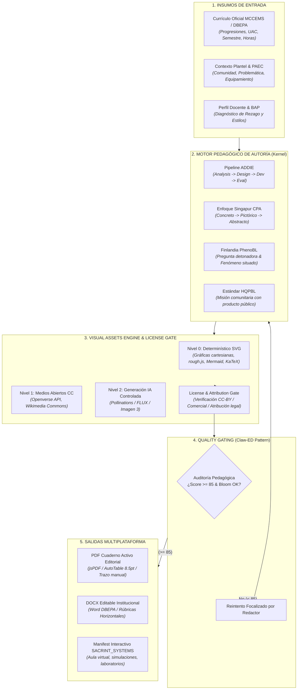

# BITÁCORA Y BLUEPRINT ARQUITECTÓNICO: SIGPDA-EMS & SACRINT_SYSTEMS
## Sistema Integral de Autoría Pedagógica, Compilación Editorial y Experiencias de Aprendizaje
### DBEPA Puebla · Bachillerato General Estatal (BGE) · Bachillerato Tecnológico (BT) · 2026-2027

> **Versión:** 1.1.0 — Consolidación de Inteligencia de Código Abierto 2026 y Arquitectura Pragmática en 3 Capas  
> **Estado:** Documento Maestro de Arquitectura y Bitácora de Evolución  
> **Propósito:** Registrar las decisiones de diseño, marcos pedagógicos adoptados, arquitectura del Visual Assets Engine y hoja de ruta de integración entre SIGPDA-EMS y el orquestador SACRINT_SYSTEMS.

---

## 1. Evaluación de Inteligencia de Código Abierto (Repositorios 2026)

Tras analizar los repositorios identificados en el estado del arte (2025-2026), se clasifica cada proyecto en una matriz de decisión: **Adoptar Concepto**, **Adaptar Módulo** o **Descartar Implementación**:

| Repositorio / Proyecto | Enfoque Principal | Veredicto Arquitectónico | Decisión para SIGPDA-EMS / SACRINT_SYSTEMS |
| :--- | :--- | :--- | :--- |
| **[DaRL-GenAI / instructional_agents](https://github.com/DaRL-GenAI/instructional_agents)** *(EACL 2026)* | Multiagente basado en ADDIE (Analysis, Design, Development, Implementation, Evaluation) con Catalog y Copilot Mode. | ⭐⭐⭐⭐⭐ **ADOPTAR CONCEPTO** | Adoptar su pipeline de fases ADDIE para el `PedagogicalEngine`. No copiar su código (es académico en Python), sino reescribir la orquestación en TypeScript nativo. |
| **[maxthraxx / openmaic](https://github.com/maxthraxx/openmaic)** | Aula interactiva multiagente: convierte documentos en aulas con profesores, compañeros IA, simulación y voz. | ⭐⭐⭐⭐⭐ **MODELO BASE SACRINT_SYSTEMS** | Este es el blueprint directo para **SACRINT_SYSTEMS**. SIGPDA compila el contenido educativo formal; SACRINT_SYSTEMS toma ese manifest y levanta el aula virtual interactiva y simulada. |
| **[epaproditus / claw-ed](https://github.com/epaproditus/claw-ed)** | Paquete de clase completo con **Pedagogical Quality Gate** (Bloom, diferenciación, estímulo-respuesta). | ⭐⭐⭐⭐⭐ **ADOPTAR MÓDULO** | Implementar su bucle estricto: `Generar -> Auditar -> ¿Cumple Score >= 85? -> Regenerar sector deficiente o Aprobar`. |
| **[chrishrp / pbl-design-tools](https://github.com/chrishrp/pbl-design-tools)** | Currículum basado en HQPBL (High Quality Project Based Learning) y Design Thinking. | ⭐⭐⭐⭐⭐ **ADOPTAR MARCO** | Integrar los 6 criterios HQPBL en el `ProjectWriter` (Misión 3 Comunitaria PAEC) para exigir un Producto Público Real. |
| **[ronda-ai / ronda-app](https://github.com/ronda-ai/ronda-app)** | PBL Lab: hitos de equipo y andamiaje dinámico (microactividades cuando el alumno se traba). | ⭐⭐⭐⭐½ **ADOPTAR ESTRUCTURA** | Enriquecer la matriz de troubleshooting y el cuaderno activo con "Micro-retos de rescate" cuando falla un experimento o despeje. |
| **[Enterprise-DNA-OS / ai-learning-path-generator](https://github.com/Enterprise-DNA-OS/ai-learning-path-generator)** | Rutas de aprendizaje, modelos mentales y grafos de prerrequisitos. | ⭐⭐⭐⭐½ **ADOPTAR PATRÓN** | Estructurar el "Concepto Cero" del libro activo como un árbol de prerrequisitos conceptuales antes del tema formal. |
| **[comfyanonymous / ComfyUI](https://github.com/comfyanonymous/ComfyUI)** | Orquestación visual modular por nodos para generación y edición de imágenes (FLUX, SD, ControlNet). | ⭐⭐⭐⭐⭐ **FUTURO BACKEND IA** | Adoptar como arquitectura de referencia para el pipeline generativo visual desacoplado en SACRINT_SYSTEMS. |
| **[WordPress / openverse](https://github.com/WordPress/openverse)** | Motor de búsqueda de 700M+ de recursos bajo licencias Creative Commons y Dominio Público. | ⭐⭐⭐⭐⭐ **CONECTAR DIRECTO** | Conector principal del `VisualAssetsEngine` para fotografías y diagramas científicos reales bajo CC-BY. |
| **PhET Simulations (Univ. of Colorado)** | Vectores y simuladores STEM. | ⚠️ **CONDICIONADO** | Licencia CC BY-NC 4.0 (No Comercial). Útil como referencia pedagógica; requiere validación estricta por el `LicenseEngine`. |

---

## 2. Paradigma Central: "Educational Content Compiler"

SIGPDA-EMS es el **Compilador Pedagógico Multimodal**. El PDF o DOCX deja de ser el origen; es solo una vista o artefacto de exportación.



---

## 3. Arquitectura del Visual Assets Engine & License Engine

### A. Estrategia Multicapa (Eficiencia, Costo Cero y Escalabilidad)
1. **Capa 0 (Determinística / 0 tokens / Costo $0.00):**
   * **Gráficas de Funciones:** Módulo matemático en Node.js que genera cadenas SVG puras para funciones lineales, cuadráticas, racionales y trigonométricas con ejes graduados y etiquetas.
   * **Geometría con Trazo Activo:** Figuras geométricas (círculos, conos, cilindros, triángulos rectángulos) estilizadas con `rough.js` para dar la apariencia de cuaderno de apuntes.
   * **Diagramas Conceptuales:** `Mermaid.js` para flujogramas de algoritmos en programación (BT), ciclos biogeoquímicos y líneas de tiempo históricas.
2. **Capa 1 (Medios Abiertos Verificados):**
   * Integración con la API de **Openverse** y **Wikimedia Commons**.
   * Búsqueda por metadatos curriculares: `biologia celular`, `circuito rlc`, `destilador quimica`.
3. **Capa 2 (Generativa IA para Portadas y Escenas Situadas):**
   * Modelos abiertos compatibles comercialmente (`FLUX.1-schnell` con licencia Apache-2.0 / Google Imagen 3 institucional).

### B. El License Engine (Blindaje Jurídico y Comercial)
Cada imagen almacenada o incrustada en un libro debe registrarse en la tabla `image_assets`:
```sql
CREATE TABLE IF NOT EXISTS image_assets (
  id UUID PRIMARY KEY DEFAULT gen_random_uuid(),
  uac_name VARCHAR(255) NOT NULL,
  category VARCHAR(100) NOT NULL, -- 'math_plot', 'scientific_diagram', 'historical', 'community'
  asset_type VARCHAR(50) NOT NULL, -- 'svg_inline', 'remote_url', 'cached_blob'
  content_data TEXT NOT NULL,      -- Código SVG o URL segura
  source VARCHAR(100) NOT NULL,    -- 'deterministic_generator', 'wikimedia', 'openverse', 'flux'
  license VARCHAR(50) NOT NULL,   -- 'Public Domain', 'CC-BY-4.0', 'Apache-2.0'
  author VARCHAR(255),
  attribution_text TEXT NOT NULL,  -- Pie de figura formal: 'Figura 1.2. Fuente: X bajo licencia Y'
  commercial_approved BOOLEAN DEFAULT TRUE,
  created_at TIMESTAMPTZ DEFAULT NOW()
);
```

---

## 4. El Marco Pedagógico Internacional Fusionado

Para superar el estándar de los libros de texto tradicionales (CECyTE, DGETI, DGB), el motor fusiona los puntos más fuertes de cada pedagogía líder:

1. **Singapur (Método CPA):**
   * *Concreto:* El libro inicia con la situación cotidiana (ej. facturación eléctrica, mezclas de granos, fallas mecánicas).
   * *Pictórico:* **Diagrama o gráfica obligatoria** antes de las fórmulas (renderizada por el Visual Assets Engine).
   * *Abstracto:* El modelo algebraico, la ley de Ohm o la ecuación diferencial.
2. **Finlandia (Phenomenon-Based Learning - PhenoBL):**
   * El bloque no es una lista de temas aislados; es la investigación de un **Fenómeno Situado Regional** de Puebla.
3. **Estados Unidos (HQPBL):**
   * El Proyecto Comunitario PAEC exige un producto público verificable (filtro de agua, prototipo funcional, campaña de salud, software administrativo escolar).
4. **Inclusión y Equidad (BAP & Rezago):**
   * Cada sesión integra andamiajes diferenciados (estrategias para estudiantes que requieren apoyo y desafíos de extensión para estudiantes avanzados).

---

## 5. Hoja de Ruta de Implementación por Fases (Sin Afectar Producción)

### Fase 1: Motor Gráfico Determinístico dentro de SIGPDA_EMS (SVG & Matemáticas)
- [ ] Crear `src/lib/visual-engine/svg-math-plotter.ts` para graficar funciones en 2D sin dependencias externas pesadas.
- [ ] Crear `src/lib/visual-engine/rough-geometry.ts` para figuras geométricas y diagramas de bloques.
- [ ] Conectar la inserción de SVGs directos en `pdf-workbook-renderer.ts` y en `ExtraPreviewModal.tsx`.

### Fase 2: License Engine & Cliente de Medios Abiertos (Openverse)
- [ ] Crear migración para la tabla `image_assets` en Neon PostgreSQL.
- [ ] Crear cliente de búsqueda `src/lib/visual-engine/openverse-client.ts` con filtro estricto de licencias comerciales (CC0, CC-BY, CC-BY-SA).
- [ ] Formatear el pie de imprenta / pie de figura legal en cada imagen insertada en el PDF.

### Fase 3: Quality Gate Pedagógico (Patrón Claw-ED)
- [ ] Reforzar `quality-validator.ts` con validación de:
  - Presencia obligatoria de componente pictórico (diagrama/gráfica) en la Misión 1 y 2.
  - Criterios HQPBL en la Misión 3 (Proyecto Comunitario).
  - Andamiaje BAP en el Acuerdo de Evaluación.

### Fase 4: Exportación del Manifest para SACRINT_SYSTEMS
- [ ] Generar un archivo JSON estandarizado (`sacrint_course_manifest.json`) que permita al proyecto hermano **SACRINT_Systems_IA** importar la planeación y convertirla en un aula interactiva con simulaciones y agentes.
